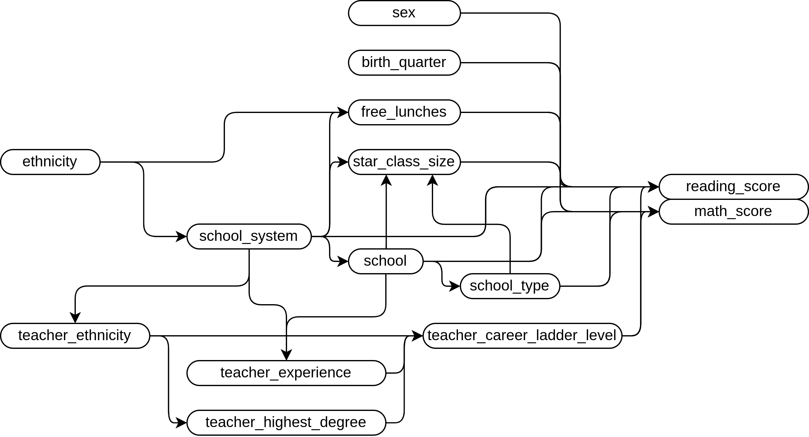

```{r, eval=TRUE, echo=FALSE, message=FALSE}
knitr::opts_chunk$set(
  eval=TRUE,
  echo=FALSE,
  message=FALSE,
  warning=FALSE
)

library(tidyverse)
library(stargazer)
library(lmtest)
library(sandwich)
library(stringi)
theme_set(theme_bw())
```

```{r}
star <- read.csv("data/star.csv") |> subset(select=c(
  rownames, gender, ethnicity, birth,
  star3, read3, math3, lunch3, school3,
  degree3, ladder3, experience3, tethnicity3,
  system3, schoolid3, readk, mathk, read1, math1,
  stark, star1, star2
)) |> na.omit()

colnames(star) <- c(
  "row", "sex", "ethnicity", "birth_quarter",
  "star_class_size", "reading_score", "math_score",
  "free_lunches", "school_type", "teacher_highest_degree",
  "teacher_career_ladder_level", "teacher_experience",
  "teacher_ethnicity", "school_system", "school",
  "reading_score_k", "math_score_k",
  "reading_score_f", "math_score_f",
  "star_class_size_k", "star_class_size_f", "star_class_size_s"
)
```

Note: I have given the terms in the dataset more sensible names to read at a glance, for myself. In the source of this document there is a `subset` call, followed by a `colnames` call which should act as a key for this change when looking into my work. I have chosen to work with grade 3 arbitrarily.

# 1. Suppose that we are interested in using this dataset to evaluate the impact of class size on test scores (we have data on reading and math). Based on the data description, would we be able to estimate a causal effect of class size on these test scores? Explain why or why not.

Tentatively, sort-of. Looking at the data, we have a stand-in for class size, not actually class size. This isn't as good as just directly having the exact number of people in the class. We also have lots of other terms which may be confounders, or would otherwise interfere with isolating the causal effect if we couldn't control for them.

The other thing we would need to do is evaluate an ADG showing which terms we should include and which not.

If we were not worried about the causal effect, and only wished to know the correlation, then we would include pretty much every term. The question is, does the ADG change that? Let's find out.

The terms I am most worried about are ethnicity. Ethnicity, unfortunately, is still a major determination of your lot in life in this country. Lots of racist people, lots of racist institutions. So, I think ethnicity causally effects a lot of things. This will be reflected in the graph. Generally, ethnicity will determine some part of location and opportunity. `teacher_highest_degree` may be lower, if they were not given good opportunities in collage because of their ethnicity; `school_system` may be different as some ethnicities are more likely to live in low-income areas; etc...

I believe that `school_system`, `school_type`, and `school` may have some determination on `star_class_size`. The population of a given area will drastically change the sizes of each class.

However, it is *also* the case that test scores are effected by the quality of schooling at those schools, and even which teachers are teaching at those schools.

I propose including `school_system`, `school_type`, and `school` along with `star_class_size`, as a minimal model for isolating the causal effect of `star_class_size` on test scores.

There are no coliders in this model, and also no descendants of `star_class_size`. The only value I do not believe has any correlation with on scores would be `sex`, but it wouldn't hurt to include it anyway, as it's possible that old-fashioned societal pressures may pressure people to do better or worse depending on their sex. So the kitchen-sink approach would not be unfounded either, as opposed to the minimal model.

(graph appears on next page $\rightarrow$)

```{r, fig.align="center", out.width="75%", fig.cap="an acyclic directed graph representing the ideas above."}

```

# 2. Using `star_class_size` as the explanatory variable, use linear regression to estimate the effect of class size on test scores. Interpret the results.

I believe you intend for me to *not* use either my minimal model, or the kitchen sink model, as you use the word "variable" as a singular. So the model I will use is: $score \sim \beta_0 + \beta_1 star\_class\_size$

```{r, out.width="75%", results="asis"}
regression_math <- star |>
  lm(formula= math_score ~ star_class_size)
regression_reading <- star |>
  lm(formula= reading_score ~ star_class_size)

stargazer(regression_math, regression_reading, type="latex", header=FALSE)
```

Test scores in both reading and math noticeably and significantly increase given a smaller class size. Adding a teaching assistant does not produce statistically significant results to analyze one way or the other.

# 3. Produce a plot that shows the effect of class size on test scores

Below are two box-plots showing test scores based on class size:

```{r, fig.align="center", out.width="67%", fig.cap="a box-plot showing the relationship between class size and math test scores."}
ggplot(star, aes(y=math_score,x=star_class_size)) + geom_boxplot()
```

```{r, fig.align="center", out.width="67%", fig.cap="a box-plot showing the relationship between class size and reading test scores."}
ggplot(star, aes(y=reading_score,x=star_class_size)) + geom_boxplot()
```

You'll notice in both plots a small, yet noticeable increase in both the median and the first and third quartiles when looking at the smaller class size vs the normal one.

# 4. Discuss why you might want to include the variable `birth_quarter` as a control variable. Explain what problem it is solving. Make reference to your answer in part 1.

`birth_quarter` may contribute to test scores for a number of reasons. It could represent students who were held back, students who are younger and thus less experienced (admittedly by a small margin) etc... It also has no effect on `star_class_size`. While including it in the model wouldn't remove any bias, it would increase accuracy.

# 5. Based on your model in part 2, create a plot that could show heteroskedasticity. Re-estimate your regression in part 2 using heteroskedasticity-robust standard errors and explain whether they change any conclusions.

So, it's at this point I really wish we had a continuous variable for class size, and not the categorical one. However, we work with what we have.

I believe the box plots above appropriately show that if there may in fact be some heteroskedasticity. The box is (admittedly very slightly) wider for smaller classes.

I'll be switching to the minimal causality model from question 1.

```{r}
regression_math <- star |>
  lm(formula= math_score ~ star_class_size + school_system + school_type + school)
regression_reading <- star |>
  lm(formula= reading_score ~ star_class_size + school_system + school_type + school)
```

The following are `coeftest`s for both models:
```{r, message=TRUE}
coeftest(regression_math, vcov=vcovHC(regression_math, type = "HC0"))
```

```{r, message=TRUE}
coeftest(regression_reading, vcov=vcovHC(regression_reading, type = "HC0"))
```

The conclusions should not change, as the findings are still statistically significant.

# 6. Is it possible to estimate clustered standard errors using this dataset? Explain why or why not. If you can, explain why you might want to, and which variable(s) you would use.

There are several clusters which could be used. Same `school`, `school_type`, `school_system`, `ethnicity`, etc... Any or all of these categorical variables may exhibit some clustering, and could be used to estimate clustered standard errors.

# 7. Test the following hypotheses:

a. Class size has no effect on test scores.

```{r}
regression_math_restricted <- star |>
  lm(formula= math_score ~ school_system + school_type + school)
regression_reading_restricted <- star |>
  lm(formula= reading_score ~ school_system + school_type + school)
```

```{r}
fstat_math <-
  (summary(regression_math)$r.squared - summary(regression_math_restricted)$r.squared) / ((1-summary(regression_math)$r.squared)/summary(regression_math)$df[2])
fstat_reading <-
  (summary(regression_reading)$r.squared - summary(regression_reading_restricted)$r.squared) / ((1-summary(regression_reading)$r.squared)/summary(regression_reading)$df[2])
```

The f-statistic for mathematics, restricting only the `star_class_size` variable, is `r fstat_math`. For reading, it is `r fstat_reading`. (Derived from the tables below.)

```{r}
critical_math <- qf(0.95,1,summary(regression_math)$df[2])
critical_reading <- qf(0.95,1,summary(regression_reading)$df[2])
```

The critical value for math is `r critical_math`, and for reading it is `r critical_reading`. Those values are both well below the f-statistics, and thus we can reject the null.

tables showing the information from which this was all derived on following pages $\rightarrow$

b. The effect of class size on test scores depends on the highest degree earned of the teacher.

New model: $score \sim \beta_0 + \beta_1 star\_class\_size + \beta_2 teacher\_highest\_degree + \beta_3 star\_class\_size teacher\_highest\_degree$

```{r}
regression_math_b <- star |>
  lm(formula= math_score ~ star_class_size + teacher_highest_degree + star_class_size * teacher_highest_degree)
regression_reading_b <- star |>
  lm(formula= reading_score ~ star_class_size + teacher_highest_degree + star_class_size * teacher_highest_degree)
regression_math_b_restricted <- star |>
  lm(formula= math_score ~ star_class_size + teacher_highest_degree)
regression_reading_b_restricted <- star |>
  lm(formula= reading_score ~ star_class_size + teacher_highest_degree)
```

```{r}
fstat_math <-
  ((summary(regression_math_b)$r.squared - summary(regression_math_b_restricted)$r.squared)/2) / ((1-summary(regression_math_b)$r.squared)/summary(regression_math_b)$df[2])
fstat_reading <-
  ((summary(regression_reading_b)$r.squared - summary(regression_reading_b_restricted)$r.squared)/2) / ((1-summary(regression_reading_b)$r.squared)/summary(regression_reading_b)$df[2])
```

The f-statistic for mathematics, restricting the interaction between `star_class_size` and `teacher_highest_degree`, is `r fstat_math`. For reading, it is `r fstat_reading`. (Derived from the tables below.)

```{r}
critical_math <- qf(0.95,2,summary(regression_math_b)$df[2])
critical_reading <- qf(0.95,2,summary(regression_reading_b)$df[2])
```

The critical value for math is `r critical_math`, and for reading it is `r critical_reading`. For mathematics, the f-statistic is above the critical value, and so we may want to reject the null, and the opposite is true of reading.

However. In both mathematics and reading several coefficients lose statistical significance, so the interpretation of that model is less concrete.

tables showing the information from which this was all derived on following pages $\rightarrow$

c. The effect of class size on test scores depends on the years of the teacher’s total teaching experience.

New model: $score \sim \beta_0 + \beta_1 star\_class\_size + \beta_2 teacher\_experience + \beta_3 star\_class\_size teacher\_experience$

```{r}
regression_math_c <- star |>
  lm(formula= math_score ~ star_class_size + teacher_experience + star_class_size * teacher_experience)
regression_reading_c <- star |>
  lm(formula= reading_score ~ star_class_size + teacher_experience + star_class_size * teacher_experience)
regression_math_c_restricted <- star |>
  lm(formula= math_score ~ star_class_size + teacher_experience)
regression_reading_c_restricted <- star |>
  lm(formula= reading_score ~ star_class_size + teacher_experience)
```

```{r}
fstat_math <-
  ((summary(regression_math_c)$r.squared - summary(regression_math_c_restricted)$r.squared)/2) / ((1-summary(regression_math_c)$r.squared)/summary(regression_math_c)$df[2])
fstat_reading <-
  ((summary(regression_reading_c)$r.squared - summary(regression_reading_c_restricted)$r.squared)/2) / ((1-summary(regression_reading_c)$r.squared)/summary(regression_reading_c)$df[2])
```

The f-statistic for mathematics, restricting the interaction between `star_class_size` and `teacher_highest_degree`, is `r fstat_math`. For reading, it is `r fstat_reading`. (Derived from the tables below.)

```{r}
critical_math <- qf(0.95,2,summary(regression_math_c)$df[2])
critical_reading <- qf(0.95,2,summary(regression_reading_c)$df[2])
```

The critical value for math is `r critical_math`, and for reading it is `r critical_reading`. For mathematics, the f-statistic is above the critical value, and so we may want to reject the null, and the opposite is true of reading.

However. In both mathematics and reading several coefficients lose statistical significance, so the interpretation of that model is less concrete.

This is the same situation as 7.b.

tables showing the information from which this was all derived on following pages $\rightarrow$

```{r, fig.align="center", out.width="75%", results="asis"}
stargazer(regression_math, regression_math_restricted, type="latex", header=FALSE)
```

```{r, fig.align="center", out.width="75%", results="asis"}
stargazer(regression_reading, regression_reading_restricted, type="latex", header=FALSE)
```

```{r, fig.align="center", out.width="75%", results="asis"}
stargazer(regression_math_b, regression_math_b_restricted, type="latex", header=FALSE)
```

```{r, fig.align="center", out.width="75%", results="asis"}
stargazer(regression_reading_b, regression_reading_b_restricted, type="latex", header=FALSE)
```

```{r, fig.align="center", out.width="75%", results="asis"}
stargazer(regression_math_c, regression_math_c_restricted, type="latex", header=FALSE)
```

```{r, fig.align="center", out.width="75%", results="asis"}
stargazer(regression_reading_c, regression_reading_c_restricted, type="latex", header=FALSE)
```

# 8. Students’ assignment to the class size groups was not held constant across the four years. Write a line or two of code that shows that this was the case.

```{r, echo=TRUE}
star_filtered <- star |> filter(
  star_class_size!=star_class_size_k |
    star_class_size!=star_class_size_f |
    star_class_size!=star_class_size_s |
    star_class_size_k!=star_class_size_f |
    star_class_size_k!=star_class_size_s |
    star_class_size_f!=star_class_size_s)

num_changed <- nrow(star_filtered)
```

It can be shown that `r num_changed` people changed class size.

# 9. What is the effect of class size in kindergarten on test scores in grade 1? How much of this effect can be attributable to the effect of kindergarten test scores on grade 1 test scores?

New model:$score_f \sim \beta_0 + \beta_1 star\_class\_size\_k + \beta_2 score\_k + \beta_3 star\_class\_size\_k \cdot score\_k$

```{r}
regression_math <- star |>
  lm(formula= math_score_f ~ star_class_size_k + math_score_k + star_class_size_k * math_score_k)
regression_reading <- star |>
  lm(formula= reading_score_f ~ star_class_size_k + reading_score_k + star_class_size_k * reading_score_k)
regression_math_restricted <- star |>
  lm(formula= math_score_f ~ star_class_size_k + math_score_k)
regression_reading_restricted <- star |>
  lm(formula= reading_score_f ~ star_class_size_k + reading_score_k)
```

```{r, fig.align="center", out.width="75%", results="asis"}
stargazer(regression_math, regression_math_restricted, type="latex", header=FALSE)
```

```{r, fig.align="center", out.width="75%", results="asis"}
stargazer(regression_reading, regression_reading_restricted, type="latex", header=FALSE)
```

The effect of k score on first grade score is much smaller than the effect of k class size on first grade score, if we allow for interaction between the two variables. Otherwise, the effects of either are about the same.